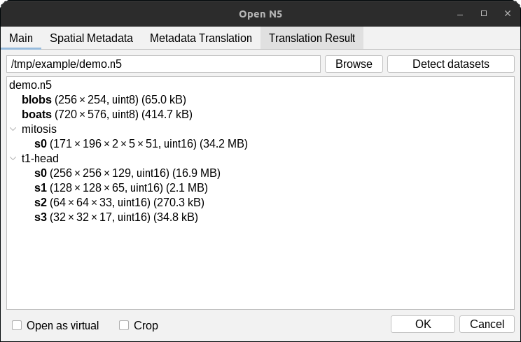
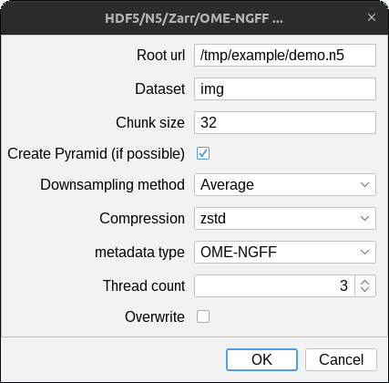

# n5-ij [](https://travis-ci.com/saalfeldlab/n5-ij)

A Fiji plugin for loading and saving image data to N5 containers. Supports [HDF5](https://www.hdfgroup.org/solutions/hdf5/), [Zarr](https://zarr.readthedocs.io/en/stable/#), [Amazon S3](https://aws.amazon.com/s3/), and [Google cloud storage](https://cloud.google.com/storage).

## Contents
1. [Open N5 datasets](#open-n5-datasets)
2. [Save N5 datasets](#save-n5-datasets)
3. [Metadata](#metadata)
4. [For developers](#for-developers)
5. [Cloud writing benchmarks](#cloud-writing-benchmarks)

## Open N5 datasets 

Open N5 datasets from Fiji with `File > Import > N5`. 

Quickly open a dataset by pasting the full path to the dataset and press `Ok`.
For example, try `gs://example_multi-n5_bucket/mitosis.n5/raw` to open the sample mitosis image from google
cloud storage.

Click the `Browse` button to select a folder on your filesystem.


The detected datasets will be displayed in the dialog. Selected (highlight) the datasets you would like to open
and press `Ok`. In the example below, we will open the datasets `/blobs`, and `/t1-head/c0/s0`.



## Save N5 datasets 

Save images open in Fiji as N5 datasets with `File > Save As > Export N5`.



## Metadata 

## For developers

ImageJ convenience layer for N5

Build into your Fiji installation:
```bash
mvn -Dscijava.app.directory=/home/saalfelds/packages/Fiji.app -Ddelete.other.versions=true clean install
```

Then, in Fiji's Scriptin Interpreter (Plugins > Scripts > Scripting Interpreter), load an N5 dataset into an `ImagePlus`:
```java
import org.janelia.saalfeldlab.n5.*;
import org.janelia.saalfeldlab.n5.ij.*;

imp = N5IJUtils.load(new N5FSReader("/home/saalfelds/example.n5"), "/volumes/raw");
```

or save an `ImagePlus` into an N5 dataset:
```java
import ij.IJ;
import org.janelia.saalfeldlab.n5.*;
import org.janelia.saalfeldlab.n5.ij.*;

N5IJUtils.save(
    IJ.getImage(),
    new N5FSWriter("/home/saalfelds/example.n5"),
    "/volumes/raw",
    new int[] {128, 128, 64},
    new GzipCompression()
);
```


## Cloud writing benchmarks

Below are a benchmarks for writing images of various sizes, block sizes, with 
increasing amount of parallelism.  

### Amazon S3

Time in seconds to write the image data. Increased parallelism speeds
up writing substantially when the total number of blocks is high.

|  Image size  | Block size |  1 thread  |  2 threads  |  4 threads  |  8 threads  |  16 threads  |
| ------------ | ---------- | ---------- | ----------- | ----------- | ----------- | ----------- |
|  64x64x64  | 32x32x32 | 0.98 | 0.60 | 0.45 | 0.50 | 0.51 | 
|  128x128x128  | 32x32x32 | 4.72 | 2.64 | 1.62 | 1.00 |
|  256x256x256  | 32x32x32 | 37.09 | 19.11 | 9.09 | 5.20 | 3.2 |
|  256x256x256  | 64x64x64 | 10.56 | 5.04 | 3.23 | 2.17 | 1.86 |
|  512x512x512  | 32x32x32 | 279.28 | 156.89 | 74.72 | 37.15 | 19.77 |
|  512x512x512  | 64x64x64 | 76.63 | 38.16 | 19.86 | 10.16 | 6.14 |
|  512x512x512  | 128x128x128 | 27.16 | 14.32 | 8.01 | 4.70 | 3.31 |
|  1024x1024x1024  | 32x32x32 | 2014.73 | 980.66 | 483.04 | 249.83 | 122.36 |
|  1024x1024x1024  | 64x64x64 | 579.46 | 289.53 | 149.98 | 75.85 | 38.18 |
|  1024x1024x1024  | 128x128x128 | 203.47 | 107.23 | 55.11 | 27.41 | 15.33 |

